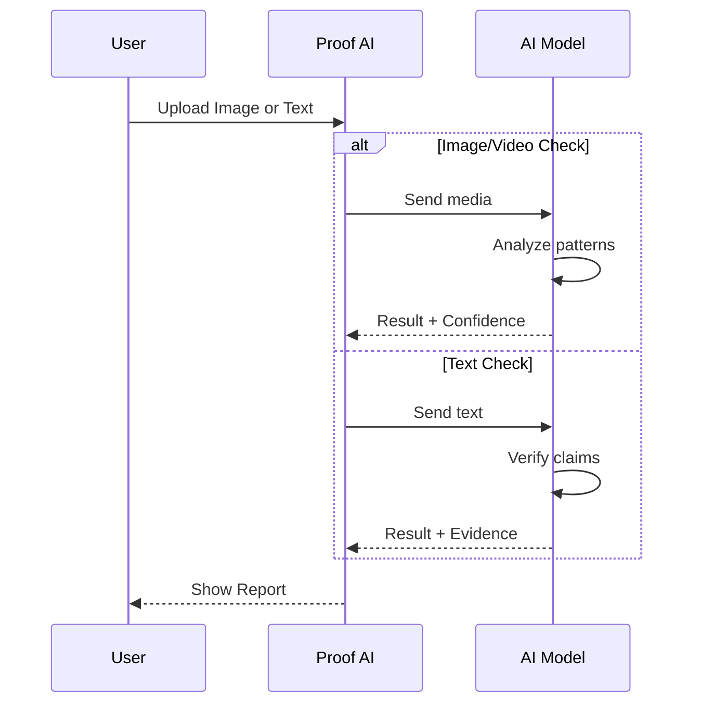

  

<h1 align="center">Trusty AI</h1>

  <b>AI-based Media Verification Tool</b> 
  A web app that checks if images, videos, or text are real or fake and gives clear proof in real-time.

  <a href="#features">Features</a> •
  <a href="#how-it-works">How It Works</a> •
  <a href="#usage">Usage</a> •
  <a href="#technical-details">Technical Details</a>

---

## Overview

Trusty AI helps you check whether content is real or created by AI.

It analyzes images, videos, and text to determine authenticity and provides a clear result with explanation.

### Key Capabilities

* Detect AI-generated images and videos
* Identify AI-written or misleading text
* Find original source of media
* Fast results with confidence score

---

## Features

### Image Analysis

* Detects fake or AI-generated visuals
* Identifies unnatural patterns, textures, and distortions
* Checks facial inconsistencies (eyes, skin, symmetry)
* Analyzes motion in videos

---

### Text Analysis

* Detects AI-generated writing patterns
* Verifies claims using real-world data
* Flags misleading or false information

---

### Source Finder

* Finds origin of images/videos
* Detects possible edits or manipulation

---

### Batch Processing

* Analyze multiple files at once
* Export results as CSV or TXT

---

## How It Works

---

## Usage

| Function         | Description               |
| ---------------- | ------------------------- |
| Image Analysis   | Detect fake images/videos |
| Text Analysis    | Verify text and claims    |
| Source Finder    | Find original source      |
| Batch Processing | Analyze multiple files    |

---

## Result Meaning

| Result      | Meaning                             |
| ----------- | ----------------------------------- |
| REAL        | Content appears authentic           |
| LIKELY_FAKE | Strong signs of AI or fake content  |
| SUSPICIOUS  | Needs manual review                 |
| DISPUTED    | Claims are incorrect or unsupported |

---

## Technical Details

| Component         | Technology                      |
| ----------------- | ------------------------------- |
| Platform          | Web Application                 |
| Frontend          | React, TypeScript, Tailwind CSS |
| Animations        | Framer Motion                   |
| AI Backend        | Gemini API                      |
| Data Verification | Google Search                   |

---

## License

MIT License

---

  Real Media needs Real Proof.

